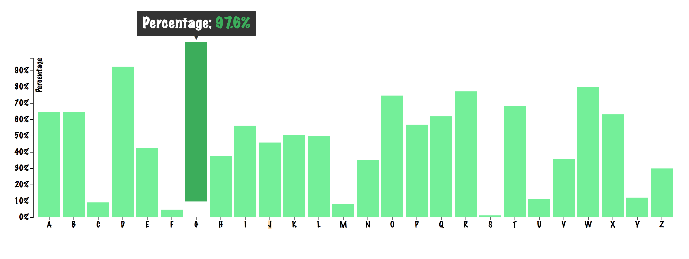

# Bar Chart

## Description:
For this assignment I created a bar chart using d3. I choose a bar chart example from: [http://bl.ocks.org/Caged/6476579](http://bl.ocks.org/Caged/6476579) and modified it.

## Background:
The bar chart I modified had an additional tooltip function added to it, which I found really interesting and wanted to experiment with.

The changes I made were mostly style based. I added a transition, so when you hover over one of the bars, it lifts up and shows you the tooltip.
I also changed the size so it matches the screen width, instead of a fixed width.

## Data:
The data used for the bar chart has no meaning, they are just random numbers. The data is formatted in percentages, with numbers ranging from 0 to 1 with 0 being 0% and 1 being 100%. The format is then changed into actual percentages, using Javascript, so it's nicer to read.

## Features:

* [scaleOrdinal](https://github.com/d3/d3-scale/blob/master/README.md#scaleOrdinal)
* [scaleLinear](https://github.com/d3/d3-scale/blob/master/README.md#scaleLinear)
* [tickFormat](https://github.com/d3/d3-axis/blob/master/README.md#axis_tickFormat)
* [max](https://github.com/d3/d3-array/blob/master/README.md#max)
* [map](https://github.com/d3/d3-collection/blob/master/README.md#map)

## License:
All rights belong to the user [Justin Palmer](https://bl.ocks.org/Caged) for his bar chart with d3-tip.